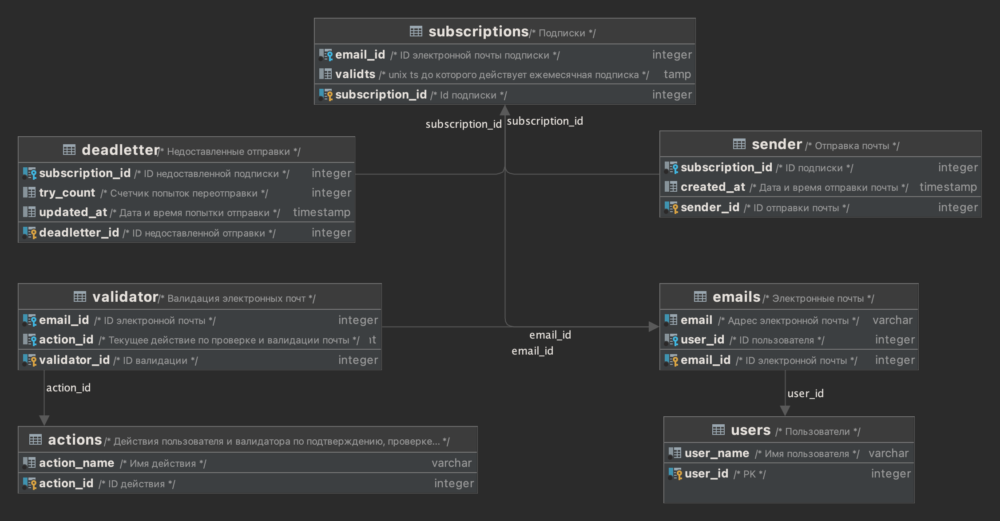

# Архитектура проекта

## База данных

База данных по аналогии с классами (поля и методы) разделена на 2 схемы: 

_Схемы базы данных_

| Схема      | Описание                          | Шаг миграции                         |
|:-----------|:----------------------------------|:-------------------------------------|
| objects    | Описание объектов                 | 0_up_create_database_and_schemas.sql |
| operations | Операции и действия над объектами | 0_up_create_database_and_schemas.sql |

_Таблицы схемы objects_

| Таблица       | Описание          | Шаг миграции                                     |
|:--------------|:------------------|:-------------------------------------------------|
| users         | Пользователи      | 1_email_sender_service_objects_users.sql         |
| emails        | Электронные почты | 2_email_sender_service_objects_emails.sql        | 
| subscriptions | Подписки          | 3_email_sender_service_objects_subscriptions.sql |

_Таблицы схемы operations_

| Таблица      | Описание                             | Шаг миграции                                     |
|:-------------|:-------------------------------------|:-------------------------------------------------|
| actions      | Справочник действий                  | 4_email_sender_service_operations_actions.sql    |
| validator    | Валидация электронных почт (очередь) | 5_email_sender_service_operations_validator.sql  | 
| sender       | Отправка почты             (очередь) | 6_email_sender_service_operations_sender.sql     |
| deadletter   | Недоставленные отправки    (очередь) | 7_email_sender_service_operations_deadletter.sql |

Справочник **actions**

_Действия пользователя и валидации по подтверждению, проверке и валидации почты_

| ID действия | Имя действия                                                                             | Кто делает                   |
|:------------|:-----------------------------------------------------------------------------------------|------------------------------|
| 0           | Почту пользователь не подтвердил по ссылке                                               | Пользователь при регистрации |
| 1           | Почта не проверена и валидность не ясна                                                  | Сервис Валидации             |
| 2           | Почта проверена и невалидна                                                              | Сервис Валидации             |
| 3           | Почта проверена и валидна                                                                | Сервис Валидации             |
| 4           | Почта проверена и валидна, но уже истек срок валидности почты, нужна повторная валидация | Сервис Валидации             | 

### Отношения в БД между таблицами



### Индексы

Создать индексы для нагруженных запросов, включая уникальные индексы

### Представления view, материализованные view

Не потребовались.

### Хранимые процедуры

1. Заполнение пользователей 1 М строк, и их почты и подписки - для тестирования

## Скрипт валидации email истекающих подписок
*Регулярность: crontab, запуск 1 раз в 12 часов - число 12 настраивается в конфиге crontab, рекомендуется ставить от 1 до 24 часов.*

Массовая валидация email истекающих подписок - делается этим скриптом массово, 
примерно за 10 дней до истечения подписки, то есть за неделю (7 дней) до отправки писем 
Константу 7, за сколько дней до отправки надо выполнить валидацию CRON_VALIDATE_BEFORE_SEND - настроить в конфиге.

Если почта валидна, но была проверена дольше чем 180 дней (VALIDATE_EXPIRE в днях - настроить в конфиге), то надо снова сделать валидацию перед отправкой.

Если почта не проверена (например дольше суток работает эта массовая валидация - если например надо все 1 млн проверить), то ящик почты проверяется перед отправкой письма.

## Скрипт отправки email
*Регулярность: crontab, 1 раз в 12 часов - настраивается в конфигурации crontab, рекомендуется ставить от 1 до 24 часов.*

1.1. Скрипт должен считывать данные из таблицы subscriptions, фильтруя строки, у которых validts < (unix ts + 3 days) && confirmed == 1.
   (константу 3, за сколько дней до истечения надо проверять и отправлять CRON_SEND_BEFORE_EXPIRE - настроить в конфиге )

1.2. Для каждого email, считанного из объединений таблиц subscriptions + emails, скрипт должен:

    a) Проверять, этот емейл валиден или нет. Cчитывать email из таблицы emails;

    b) Если checked == 0, то:

        b.1)  Вызвать check_email() функцию для валидации адреса

        b.2)  Обновить таблицу emails проставив checked = 1 и valid = 0/1 в зависимости от результата работы check_email();

    с) Отправить email нотификацию пользователю, если email валиден:

        c.1) Если valid == 1, вызвать send_email()  чтобы отправить нотификацию пользователю;

## Скрипт обработки dead letter
*Регулярность: crontab, запуск раз в 12 часов - вынесено в конфиг dead_letter_period, рекомендуется ставить от 1 до 24 часов.*

# Техподдержка системы:

Таблица dead letter - отправки, непроверенные вовремя скриптом отправки email, а значит затем и недоставленные/просто недоставленные 
- их надо отправлять в таблицу dead_letter - [описание принципа](https://habr.com/ru/company/southbridge/blog/691682/)

Что такое очередь недоставленных сообщений?
Очередь недоставленных сообщений (Dead Letter Queue, DLQ) в системе обмена сообщениями или на платформе потоковой обработки данных отвечает за хранение сообщений,
которые не были успешно обработаны. Система не отбрасывает сообщение, а перемещает его в очередь недоставленных.

Там поле try_count увеличивать на +1 каждый час, и доходит до dead_letter_limit = 10 и настраивается в конфиге. 
И потом если достигнут был максимум попыток, то уходит письмо + уведомление в Телеграм - дежурному на разбор 
(уходят все dead letter раз в час, пачкой, за сутки 24 писем с такими отправками).

## Проектирование Архитектуры (System Design)
### 23 Паттерна проектирования:
https://refactoring.guru/ru/design-patterns
Выписать возможные проблемы в проекте, и обдумать, какими паттернами их можно решить ?

Пригодятся такие паттерны:

- Module Pattern
An implementation of the module pattern would make sure that each element can be removed or swapped

- Model-View-Controller (См. Laravel, Symfony, Yii)
Model View Controller, сокращенно MVC, представляет собой шаблон проектирования, в котором бизнес-логика, логика представления и связывания разделены. 
Большая часть бизнес-логики происходит в сервисах, репозиториях и моделях, тогда как контроллеры отображают данные модели в представления.

- Front Controller
Шаблон Front Controller для реализации рабочих процессов своего приложения. Он имеет единую точку входа (script.php) для всех своих запросов.

### 26 Паттернов микро сервисной архитектуры:
(https://microservices.io/patterns)
Исследовать, какие паттерны MSA в этом проекте нам могут пригодиться ?

- Для нагрузки проекта в 1 М пользователей - достаточно написать 3 простых скрипта.

###  Дизайн системы (Архитектура)

Рассчитать дизайн, минимально удовлетворяющий требованиям к нагруженной системе:

[Дизайн высокой нагрузки](https://github.com/donnemartin/system-design-primer/blob/master/solutions/system_design/scaling_aws/README.md)

- Достаточно применения компонентов, указанных в [docker](docker.md)
- Если в будущем потребуется масштабировать на 2 миллиарда пользователей, тогда надо применять инструменты, о которых я рассказывал [вот здесь](https://cloud.mail.ru/public/oi8L/5Gq1fVsJB)

## Проектирование технологий:
- DDD и TDD применить
- сделать миграции SQL, сделать откат миграций, индексы грамотно сделать, включая уникальные
- считывание и отправку сделать пакетами, а не сразу 1 миллион (в худшем случае) считывать в память, по 1000-5000 записей (вынести в конфиг CHUNK=1000)

### Модульная архитектура
[Модульная архитектура](https://habr.com/ru/post/145946/)
- сделать как модуль композера - это package.json - [https://getcomposer.org/doc/](https://getcomposer.org/doc/)
- в композере прописать нужные для работы скрипты - "scripts": {} - [https://getcomposer.org/doc/articles/scripts.md](https://getcomposer.org/doc/articles/scripts.md)
- так как нет классов, то подключаем UI библиотеки через [autoload files](https://getcomposer.org/doc/04-schema.md#files)

- [Паттерн CRUD для PostgresSQL](https://phpforever.com/postgresql/crud-example-using-php-object-oriented-and-postgresql)

## Перспективы на будущее:
- сделать OpenAPI / Swagger для документирования API - [https://cdnjs.com/libraries/swagger-ui](https://cdnjs.com/libraries/swagger-ui)
- кеширование предусмотреть/продумать - Redis/Memcached
- самое нагруженное можно написать и как модуль PHP на C++ (или на GO lang) -  [https://www.php-cpp.com/documentation/your-first-extension](https://www.php-cpp.com/documentation/your-first-extension)
- можно сделать UI красивый как панель администратора, для редактирования этих таблиц
- можно реализовать то же самое на языках: GO и других

## Тестирование:
- Для тестировщика: по команде наполнить БД 1 М тестовых записей, сразу. Иметь команду очистки таблиц truncate.
- Codeception: сделать unit тесты + АПИ тесты - написать codeception.yml и тесты

## DevOps:
- Написать Dockerfile / docker-compose.yml для kubernetes

## Сопровождение:
- Сгенерировать документацию с помощью phpDocument или подобных
- АПИ-документация в OpenAPI 

## Технологический стек:
- Для 1 М пользователей будет достаточен PHP 8.2, для скорости - без фреймворков, но с включенной jit-компиляцией в php.ini:
```
opcache.enable=1
opcache.enable_cli=1
opcache.jit_buffer_size=128M
```
- PostgresSQL последней версии
- Docker и Kubernetes для оркестрации контейнеров и масштабирования нагрузки

Февраль 2023 (С) Разработчик дизайна архитектуры: Наумов Дмитрий Витальевич - http://azasystems.ru
